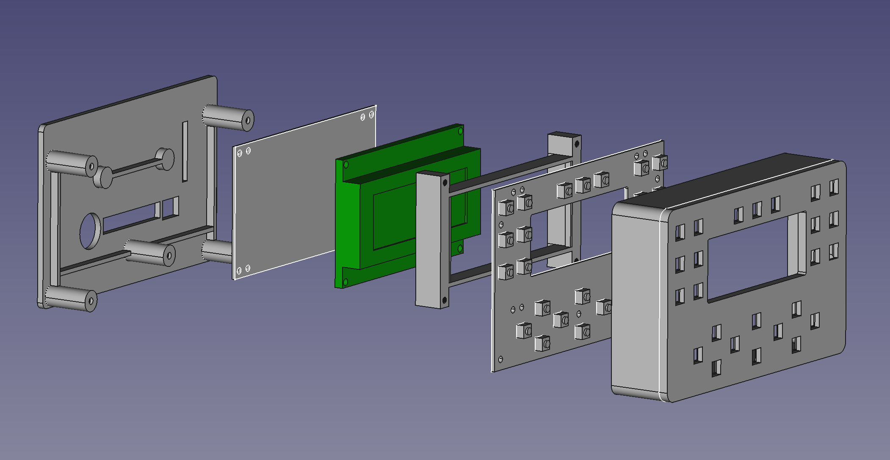
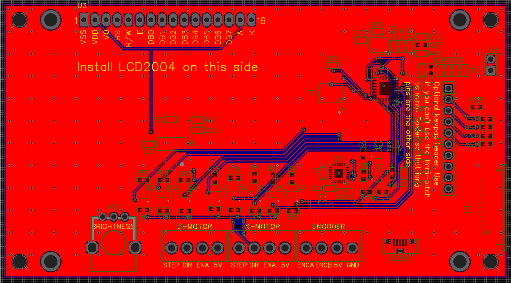
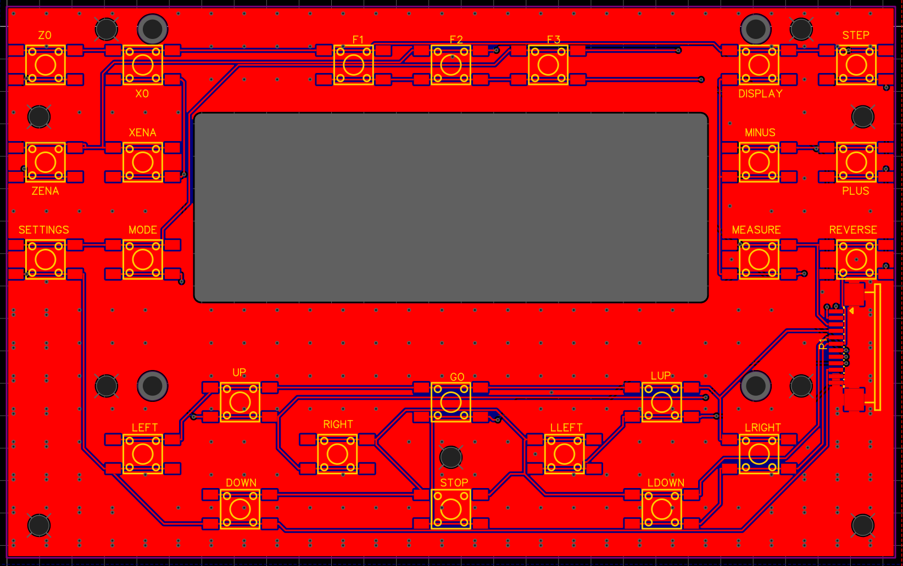
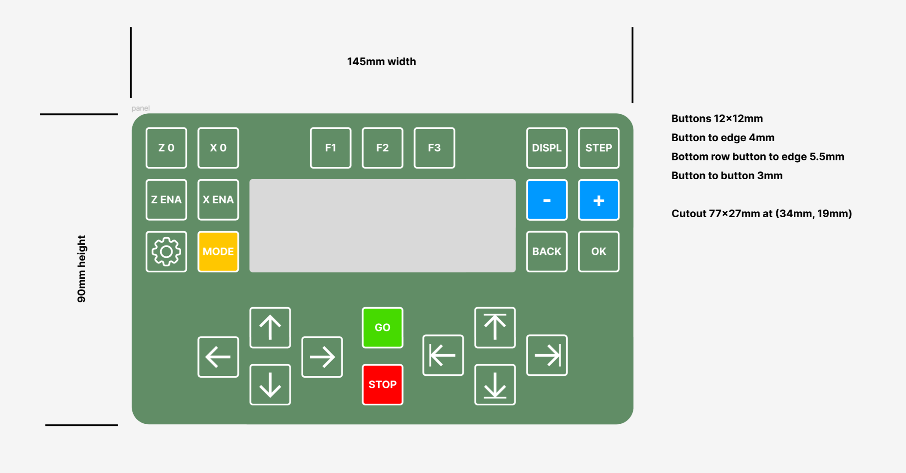
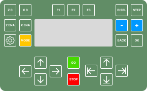

This project is provided "as is", without warranty of any kind ([see license](LICENSE)).

# espina

ESP32 controller (PCBs, screen, case) with 1 encoder and 2 steppers. It can be used to control machinery e.g. a metal lathe or a gear cutter. Device can easily be programmed with Arduino or similar IDEs via a USB port.

# Parts

- 2x custom PCBs
- LCD 2004 standard 4-line screen
- [12-pin same-side 1mm pitch FFC connector 5cm](https://www.lcsc.com/product-detail/_JUSHUO-_C2857580.html)
- 4x 3D-printed plastic parts
- 13x M3 bolts

# Printed circuit boards

Schematics and PCB layout can be viewed and edited using EasyEDA by copying [respective projects](https://github.com/kachurovskiy/espina/tree/main/easyeda) to your local computer and opening them in the editor.

Gerber, BOM and pick-and-place files can be found in the [respective folder](https://github.com/kachurovskiy/espina/tree/main/gerber). Smallest production run of these boards on JLCPCB would cost [$200 for 5 boards each](https://user-images.githubusercontent.com/517919/224640478-c27c72a2-1f7f-4686-9f80-fe1553a87b9b.png).

Note: when ordering, JLCPCB sometimes doesn't recognize the FFC terminal part. Use the "Find part" feature, find and select [C14431](https://www.lcsc.com/product-detail/FFC-FPC-Connectors_JUSHUO-AFA07-S12FCC-00_C14431.html). Also, exclude the 2.54 headers from PCBA since you probably don't need them.

# Case

Case is designed to be 3D-printed and consists of 4 parts. It assembles together with 12 M3 bolts, each 5mm long. Galvanized steel bolts are ideal since printed threads are usually too tight for nylon bolts.

# Front panel

Front panels can be printed at home or ordered on [jrpanel.com](https://www.jrpanel.com/panel/buy/) for around $200 (if you reduce # of colors) however you might want to design your own one based on the button functions in your software.

There's also a [PDF version](images/panel.pdf). You can edit the SVG on [figma.com](https://www.figma.com/) for free.

# Software

One sample program for this controller is a single-axis electronic lead screw for a metal lathe, see [espinaels](https://github.com/kachurovskiy/espina/tree/main/espinaels) folder.

# Project status

This project "archived" - I decided to completely re-design it so making this historical version available for free. Drawbacks of the current design are poor LCD viewing angles, older ESP32 version, lack of ESD protection, only 2 axes, old-style USB port. This version of the ELS software will not be developed or maintained - however it might be a nice starting point if you'd like to make something similar.

# Contributions

Please report any bugs or problems. For changes and improvements, it's suggested to fork the repository and develop separately.
